# QuasarDB — Подсистема хранения данных (Storage Engine)

> **Расположение:** `apps/storage/`
> **Язык:** C++20 (concepts, variants, smart pointers, `std::filesystem`)
> **Архитектура:** Классическая RDBMS с кастомным B*+ деревом, slotted-page storage, WAL-журналом

---

## 1. Общая архитектура

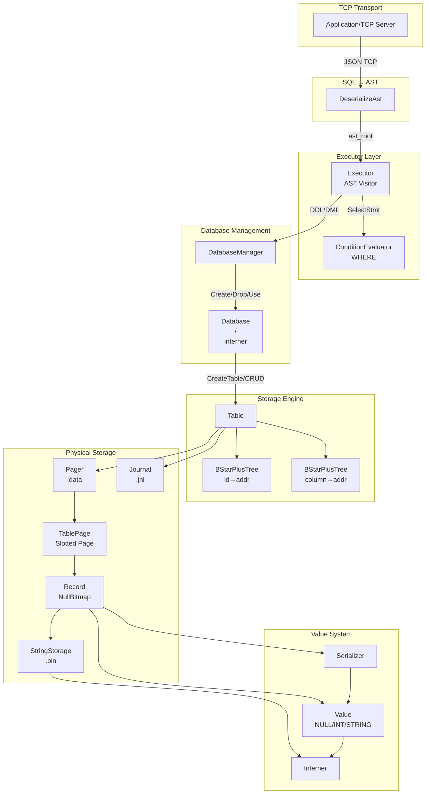

### Диаграмма файлов на диске (на одну таблицу)

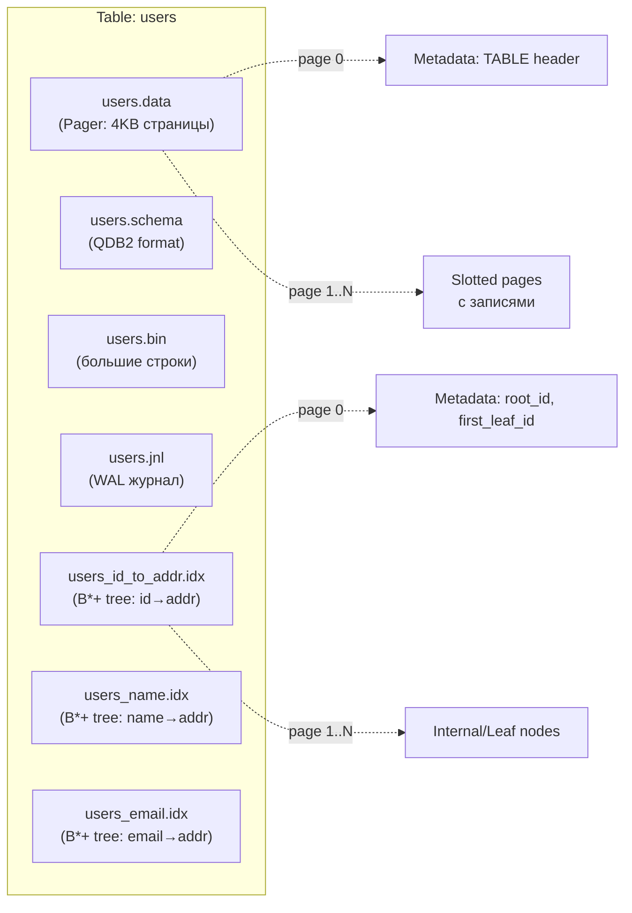

---

## 2. Value — система типов

```cpp
class Value {
    std::variant<std::nullptr_t, int32_t, InternedString> _data;
};
```

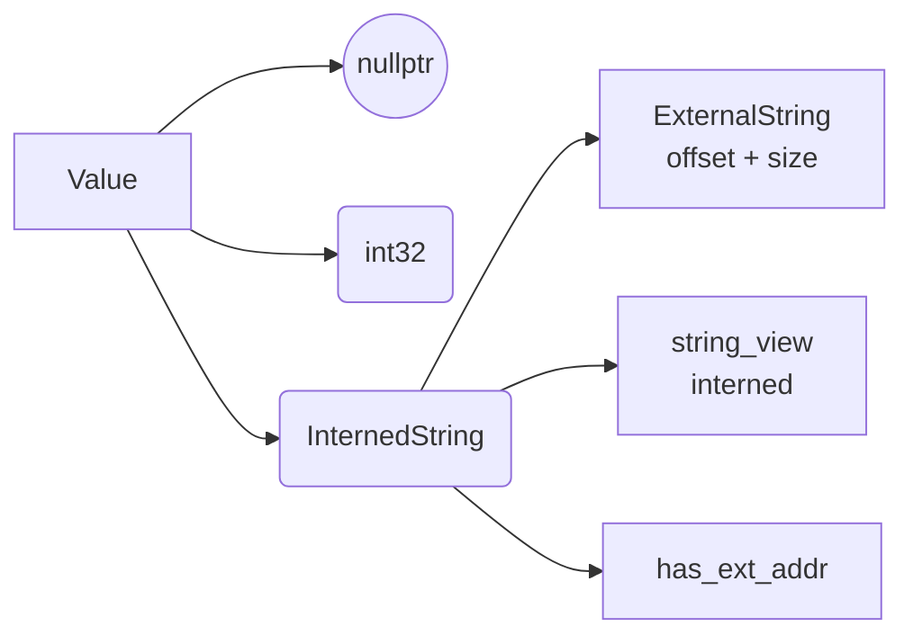

### Трёхзначная SQL-логика (SqlBool)

```c
enum class SqlBool { FALSE, TRUE, UNKNOWN };
```

| a | b | a && b | a \|\| b | !a |
|---|---|--------|----------|-----|
| T | T | T | T | F |
| T | F | F | T | - |
| T | U | U | T | - |
| F | T | F | T | T |
| F | F | F | F | - |
| F | U | F | U | - |
| U | T | U | T | U |
| U | F | F | U | - |
| U | U | U | U | - |

**Правила сравнения:** любой оператор (`==, <, <=, >, >=, !=`) с `NULL` даёт `UNKNOWN`.  
`StrictEq()` — двузначное сравнение (игнорирует SQL-NULL propagation), используется при проверке уникальности индексов.

---

## 3. Interner — интернирование строк

```cpp
class Interner {
    std::unordered_set<std::string_view> _str_view_set;
    std::deque<std::string> _str_storage;
};
```

- Каждая строка хранится ровно один раз в `deque`
- `unordered_set<string_view>` — быстрый поиск
- Время жизни = время жизни `Database`
- Используется **везде** при десериализации строк

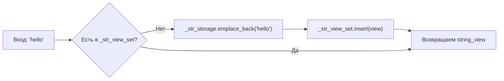

---

## 4. StringStorage — большие строки

**Файл:** `<table>.bin`

Строки длиннее `PAGE_SIZE / 2 = 2048` байт хранятся **внешне**.

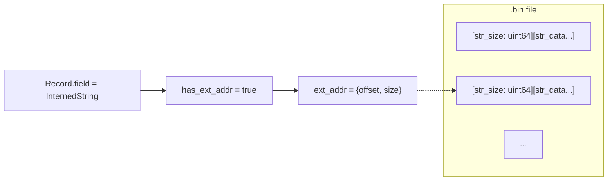

```
ExternalString {
    uint64_t offset;  // смещение в .bin файле
    uint64_t size;    // длина строки
}
```

Формат записи в `.bin`:
```
[uint64: str_size][char[str_size]: str_data]
```

---

## 5. Pager — файловый менеджер страниц

```cpp
class Pager {
    size_t page_size;        // 4096
    std::fstream db_file;    // <table>.data
    std::vector<uint8_t> white_page;  // zeroed page для append
};
```

```
.data file: [page_0][page_1][page_2]...[page_N]
            \_____4096 bytes each______/
```

```mermaid
graph LR
    subgraph "Pager API"
        RP[read_page(id, buf)]
        WP[write_page(id, data)]
        AP[append_new_page]
        T[truncate(count)]
    end

    subgraph "Файл .data"
        F0["page 0<br/>(metadata)"]
        F1["page 1<br/>(data)"]
        ...
        FN["page N<br/>(data)"]
    end

    RP -.->|seekg(id*4096)| F1
    WP -.->|seekp(id*4096)| F1
    AP -.->|seekp(end), write| F2["page N+1"]
```

---

## 6. TablePage — Slotted Page Architecture

```cpp
union DataPage {
    PageHeader header;
    uint8_t raw[PAGE_SIZE];  // 4096
};

struct PageHeader {
    uint32_t page_id;
    uint32_t slot_count;
    uint32_t free_space_upper;  // указатель на свободное место
    uint32_t total_free_bytes;
};

struct Slot {
    uint32_t record_offset;
    uint32_t record_size;
    uint32_t record_id;
    bool deleted;
};
```

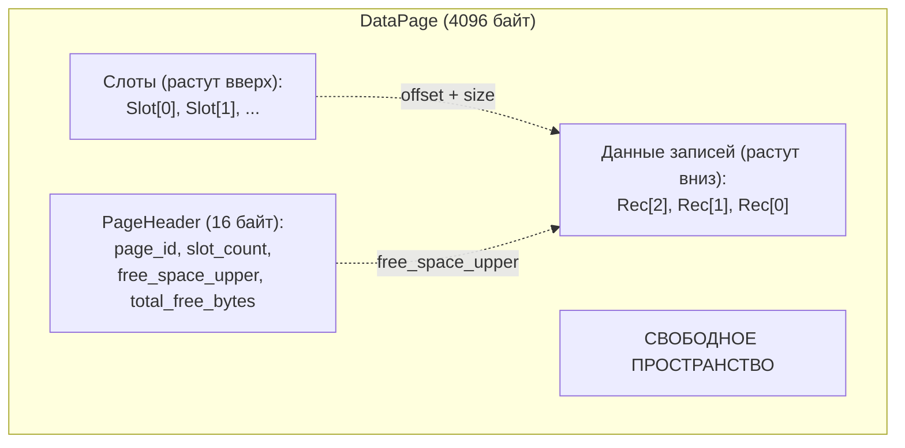

### Compact

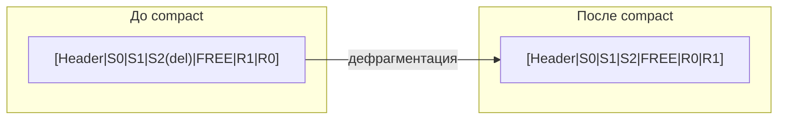

При вставке: если нет непрерывного куска нужного размера → `compact()`, затем запись.

Удаление: `slot.deleted = true`, обрезка хвоста удалённых слотов.

Максимальный размер записи: `PAGE_SIZE - sizeof(PageHeader) - sizeof(Slot) ≈ 4072 байта`.

---

## 7. B*+ Tree — индексная структура

**Файлы:** `<table>_<column>.idx`, `<table>_id_to_addr.idx`

### 7.1 Почему B*+, а не B/B+?

| Свойство | B-tree | B+ tree | B*+ tree |
|----------|--------|---------|----------|
| Данные в листьях | - | + | + |
| Листья связаны списком | - | + | + |
| Мин. заполненность | ≥50% | ≥50% | **≥66%** |
| Redistribute до split | - | - | + |

B*+ **сначала пытается перераспределить** ключи между соседями. Если не получается — split на 3 узла, а не на 2. Это даёт заполненность ≥2/3.

### 7.2 Узел (Node) — ровно одна страница (4096 байт)

```cpp
union NodePage {
    NodeHeaderStruct header;
    InternalStruct internal_data;
    LeafStruct leaf_data;
    uint8_t raw[PAGE_SIZE];
};

struct NodeHeaderStruct {
    char header[18];      // "BSTARPLUSTREE_NODE\0"
    int32_t node_id;      // page_id
    bool is_leaf;         // true=LEAF, false=INTERNAL
    int32_t keys_size;    // количество ключей
    bool deleted;         // помечен на удаление
};
```

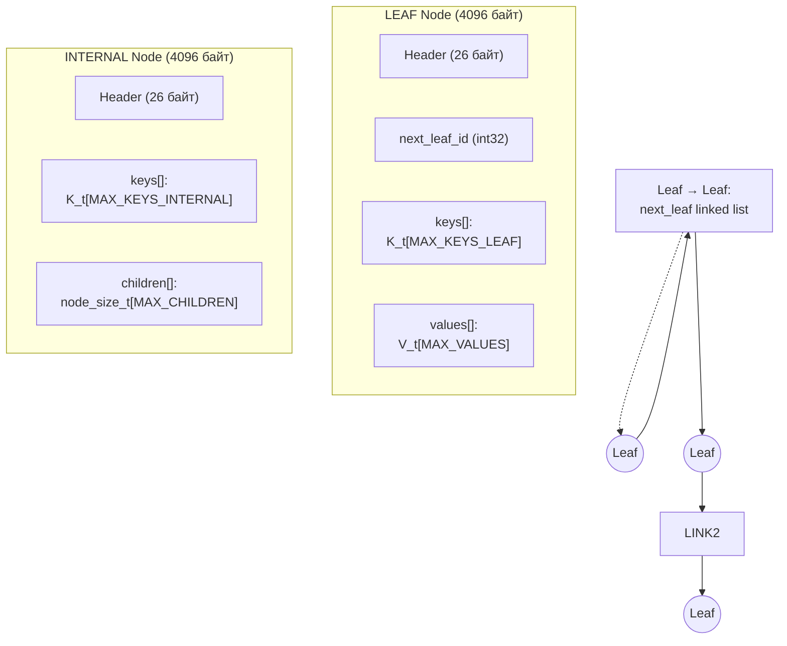

### 7.3 Вместимость узлов

```cpp
// Для ключа int32_t (4 байта) и значения RecordAddress (8 байт):
PHYS_KEYS_INTERNAL = (4096 - 26 - 4) / (4 + 4) = 506
MAX_KEYS_INTERNAL = 505
MIN_KEYS_INTERNAL = (2*506 - 1)/3 = 337

PHYS_SIZE_LEAF = (4096 - 26 - 4) / (4 + 8) = 338
MAX_KEYS_LEAF = 337
MIN_KEYS_LEAF = (2*338 - 1)/3 = 225
```

### 7.4 Поиск — `search(key)`

```mermaid
flowchart TD
    START[Начать с root] --> CHECK{empty?}
    CHECK -->|Да| RET0[return []]
    CHECK -->|Нет| CUR["cur = root"]
    CUR --> LOOP{is_leaf?}
    LOOP -->|Нет| FIND["idx = find_child_idx(key)<br/>(std::lower_bound)"]
    FIND --> PUSH["parentStack.push({cur.id, idx})"]
    PUSH --> CUR2["cur = cur.get_child(idx)"]
    CUR2 --> LOOP
    LOOP -->|Да| IDX["idx = find_key_idx_by_approx(key)"]
    IDX --> MATCH{idx != -1?}
    MATCH -->|Нет| RET0
    MATCH -->|Да| ITER["Iterator от idx<br/>проходит по linked list листьев"]
    ITER --> CMP{"key == it.key()<br/>(или SearchCmp == 0)"}
    CMP -->|Да| ADD["result += it.value()<br/>++it"]
    CMP -->|Нет| RET["return result"]
    ADD --> CMP
```

### 7.5 Вставка — `insert(key, value)`

```mermaid
flowchart TD
    START{empty?} -->|Да| CR["create_root()<br/>новый LEAF"]
    START -->|Нет| FL["findLeaf(key, parentStack)"]
    CR --> FL
    FL --> INS["insert_in_leaf(key, value)"]
    INS --> OVF{overflow?}
    OVF -->|Нет| RET["✓"]
    OVF -->|Да| HLO["handleLeafOverflow(leaf, parentStack)"]

    subgraph "handleLeafOverflow"
        HLO --> IS_ROOT{leaf == root?}
        IS_ROOT -->|Да| S12["splitLeaf1to2()<br/>→ 2 листа + новый INTERNAL root"]
        IS_ROOT -->|Нет| P[parent = parentStack.top()]

        P --> LEFT{left сосед exists<br/>и can_take?}
        LEFT -->|Да| RED2["redistributeLeaves2to2(left, leaf, parent)"]
        LEFT -->|Нет| RIGHT{right сосед exists<br/>и can_take?}
        RIGHT -->|Да| RED2B["redistributeLeaves2to2(leaf, right, parent)"]
        RIGHT -->|Нет| S23{"splitLeaves2to3()<br/>→ 3 листа"}
        S23 --> POFV{parent overflow?}
        POFV -->|Да| HIO["handleInternalOverflow(parent, parentStack)"]
    end

    subgraph "splitLeaves2to3"
        S2["total = left + right"]
        S3["s1 = total/3, s2=(total-s1)/2, s3=total-s1-s2"]
        S4["Создаём n3 (новый LEAF)"]
        S5["mid_2 = right.send_to_right(n3, s3)"]
        S6["mid_1 = left.send_to_right(right, s2-right.size)"]
        S7["n3->next = right->next<br/>right->next = n3"]
        S8["parent.insert(mid_2, n3)"]
        S9["parent.set_key(mid_1, left_idx)"]
    end

    subgraph "splitInternal2to3"
        SI["Аналогично splitLeaves2to3,<br/>но для INTERNAL узлов<br/>с учётом mid_key из parent"]
    end

    subgraph "splitLeaf1to2 / splitInternal1to2"
        S1["new_root = INTERNAL<br/>new_root->child[0] = node"]
        S2B["right = новый узел"]
        S3B["redistribute (node, right, new_root, 0)"]
        S4B["node.set_next(right.id)"]
    end
```

### 7.6 Удаление — `remove(key)`

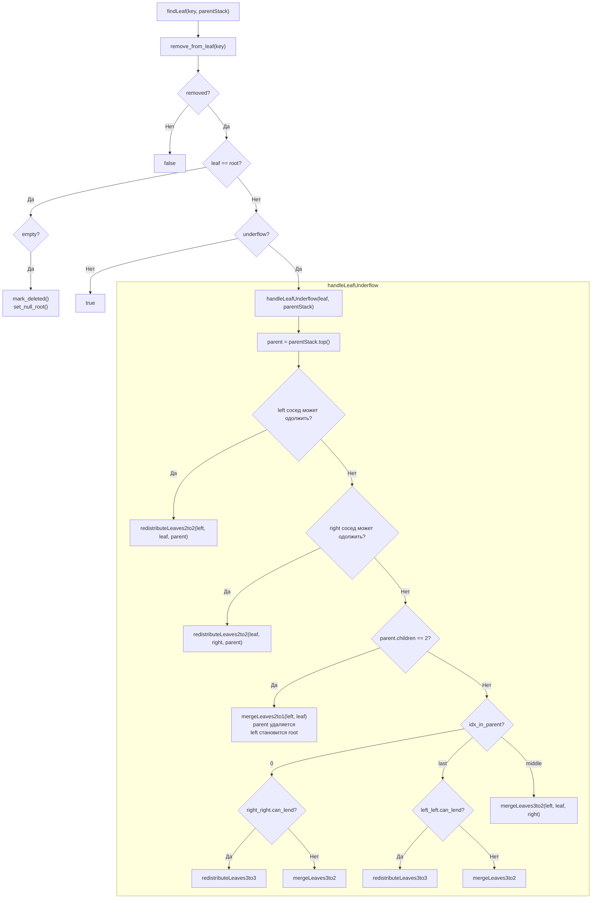

### 7.7 Итератор — Range Scan

```cpp
// Проход по linked list листьев
for (auto it = Iterator(first_leaf, 0, &pager); it != end(); ++it) {
    // it.key(), it.value()
}
```

Позволяет эффективно выполнять `rangeSearch(low, high)`:
- Найти первый лист с `key >= low`
- Итерироваться по листьям через `next_leaf`
- Остановиться когда `key > high`

### 7.8 Проверка целостности

`check_integrity()` рекурсивно проверяет:
- Каждый узел: `size >= minAllowed` и `!overflow`
- Ключи отсортированы в каждом узле: `key[i] < key[i+1]`
- Ключи разделяют детей: `childMax < key[i] <= childMin(next)`
- Для root-child применяется `MAX/2` вместо `MIN`

---

## 8. FastStr — ключ для строковых индексов

```cpp
struct FastStr {
    char _prefix[8];     // первые 8 байт строки
    int32_t _record_id;  // для разрешения коллизий
};
```

- `operator<`: сначала `memcmp` префиксов, потом `record_id`
- `SearchCmp`: только `memcmp` префиксов (без `record_id`) — для поиска всех записей с одинаковым префиксом
- 12 байт на ключ → помещается 337+ ключей в лист

Пример: строки `"hello world"` и `"hello foo"` → `_prefix = {'h','e','l','l','o',' ','w','o'}`.

---

## 9. Record — сериализация записей

### Null Bitmap

Для каждой колонки, у которой `NOT_NULL = false`, выделяется 1 бит в null bitmap.

```cpp
// null_bitmap_size = (число nullable колонок + 7) / 8
```

### Бинарный формат

```
[null_bitmap: X байт] [value_0] [value_1] ... [value_N]
```

Где каждый `value`:

- **INT:** `[int32: 4 байта]`
- **STRING inline** (≤2048 байт):
  ```
  [flag_has_ext_addr=false: 1 байт]
  [len: uint32]
  [str_data: len байт]
  ```
- **STRING external** (>2048 байт):
  ```
  [flag_has_ext_addr=true: 1 байт]
  [ext_addr: ExternalString = offset+size = 16 байт]
  ```

### RecordAddress

```cpp
struct RecordAddress {
    uint32_t page_idx;  // номер страницы в .data
    uint32_t slot_idx;  // индекс слота на странице
};
```

---

## 10. Schema — метаданные колонок

### Формат `.schema` файла (QDB2)

```
[HEADER: "SCHEMA" (5 байт)]
[FORMAT_MAGIC: 0x51444232 = "QDB2" (4 байта)]
[FORMAT_VERSION: 2 (4 байта)]
[record_id_count: uint32]
[columns_count: uint32]
[column_0:
  [name_length: uint32]
  [name: name_length байт]
  [type: uint8]        // 0=INT, 1=STRING
  [flags: uint8]       // bit0=NOT_NULL, bit1=INDEXED
  [default_type: uint8] // 0=NONE, 1=NULL, 2=INT, 3=STRING
  [default_int: int32]
  [default_string_length: uint32]
  [default_string: ...]
]
[column_1: ...]
```

### Column

```cpp
Column("name", ColumnType::STRING, INDEXED_FLAG | NOT_NULL_FLAG);
// NOT_NULL автоматически добавляется при INDEXED
```

---

## 11. Journal — WAL с временным откатом

**Файл:** `<table>.jnl`

### Формат трека

```
[TIME: 23 байта, "2026.05.23-14:30:00.123"]
[record_id: uint32]
[type: uint8]           // 0=INSERT, 1=UPDATE, 2=DELETE
[data_size: uint32]     // только для INSERT/UPDATE
[serialized_record: data_size байт]  // только для INSERT/UPDATE
[total_track_size: uint32]  // для обратного чтения
```

**Важно:** `save_insertion` пишет `DELETE` трек (старое состояние — удаление), а `save_deletion` пишет `INSERT` трек. Это сделано для revert: при откате INSERT выполняется DELETE операции и наоборот — журнал хранит обратную операцию.

| Действие | Тип трека | Что хранится |
|----------|-----------|--------------|
| INSERT | DeleteTrack | `record_id` |
| UPDATE | UpdateTrack | **Старая** версия записи |
| DELETE | InsertTrack | **Старая** версия записи |

### Revert

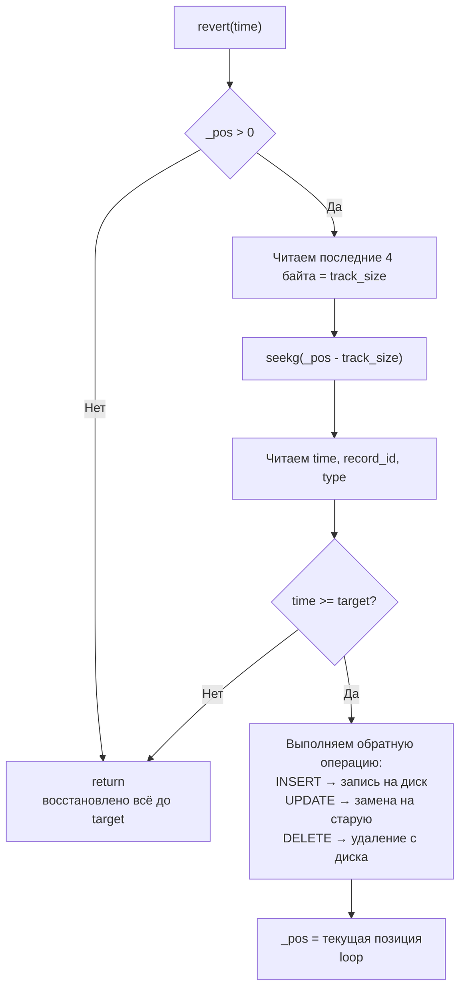

Бранч-отсечение: если после revert сделать insert, файл обрезается до `_pos`.

---

## 12. Table — полный CRUD

### Файлы одной таблицы

```
<table>/                     # внутри Database/<name>/
├── <name>.data             # Slotted pages (Pager)
├── <name>.schema           # QDB2 метаданные
├── <name>.bin              # Большие строки
├── <name>.jnl              # WAL журнал
├── <name>_id_to_addr.idx   # B*+ tree: record_id → RecordAddress
├── <name>_<col1>.idx       # B*+ tree: индекс по колонке 1
└── <name>_<col2>.idx       # B*+ tree: индекс по колонке 2
```

### insert_record — полный цикл

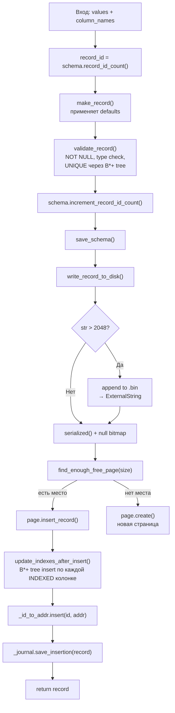

### update_record

1. Читаем старую запись
2. `delete_record` на старой странице (slot.deleted = true)
3. `write_record_to_disk` — запись на новое место (или ту же страницу, если там освободилось место)
4. Если адрес изменился → `update_indexes` + `_id_to_addr.update`

### delete_record

1. `table_page.delete_record(slot_idx)` — пометить deleted
2. `update_indexes_after_delete` — удалить из B*+ деревьев
3. `_id_to_addr.remove(id)`
4. `_journal.save_deletion` — сохранить копию записи

---

## 13. Database / DatabaseManager

### Database

- `CreateTable(name, schema)` → создаёт `Table` (вызывает конструктор создания)
- `DropTable(name)` → `table.drop()` + удаление из `tables_`
- Загружает существующие таблицы из `.schema` файлов в директории

### DatabaseManager

- `CreateDatabase(name)` → создаёт поддиректорию
- `DropDatabase(name)` → `fs::remove_all()`
- `UseDatabase(name)` → возвращает `Database*`

---

## 14. Executor — исполнение AST

```mermaid
flowchart LR
    subgraph "AST Node Types"
        A[CreateDatabaseStmt]
        B[DropDatabaseStmt]
        C[UseDatabaseStmt]
        D[CreateTableStmt]
        E[DropTableStmt]
        F[InsertStmt]
        G[UpdateStmt]
        H[DeleteStmt]
        I[SelectStmt]
        J[AggregateExpr<br/>COUNT/SUM/AVG]
    end

    subgraph "Executor"
        V[Visitor pattern]
    end

    A --> V --> M[db_manager.CreateDatabase]
    F --> V --> N[db.UseDatabase<br/>-> table.insert_record]
    I --> V --> O[table.records()<br/>+ ConditionEvaluator<br/>+ Aggregation]
    J --> V --> P[COUNT/SUM/AVG over filtered records]
```

### Select с агрегацией

```
SELECT COUNT(*), AVG(age) FROM users WHERE age > 18
```

1. `table.records()` — итерация по `_id_to_addr` (0..record_id_count-1)
2. `ConditionEvaluator::Evaluate(WHERE)` — фильтр каждой записи
3. Агрегация: COUNT, SUM, AVG по отфильтрованным записям
4. Результат → `nlohmann::json`

---

## 15. ConditionEvaluator — WHERE

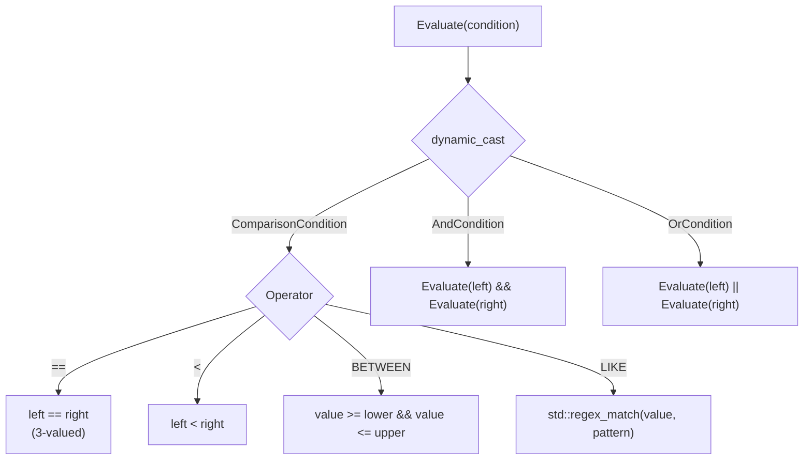

- `ValueOf(IdentifierExpr)` → `record_[schema.get_column_idx(name)]`
- `ValueOf(LiteralExpr)` → `Value(std::stoi(...))` или `interner.str_to_value(...)`

---

## 16. Полный поток выполнения: от TCP до диска

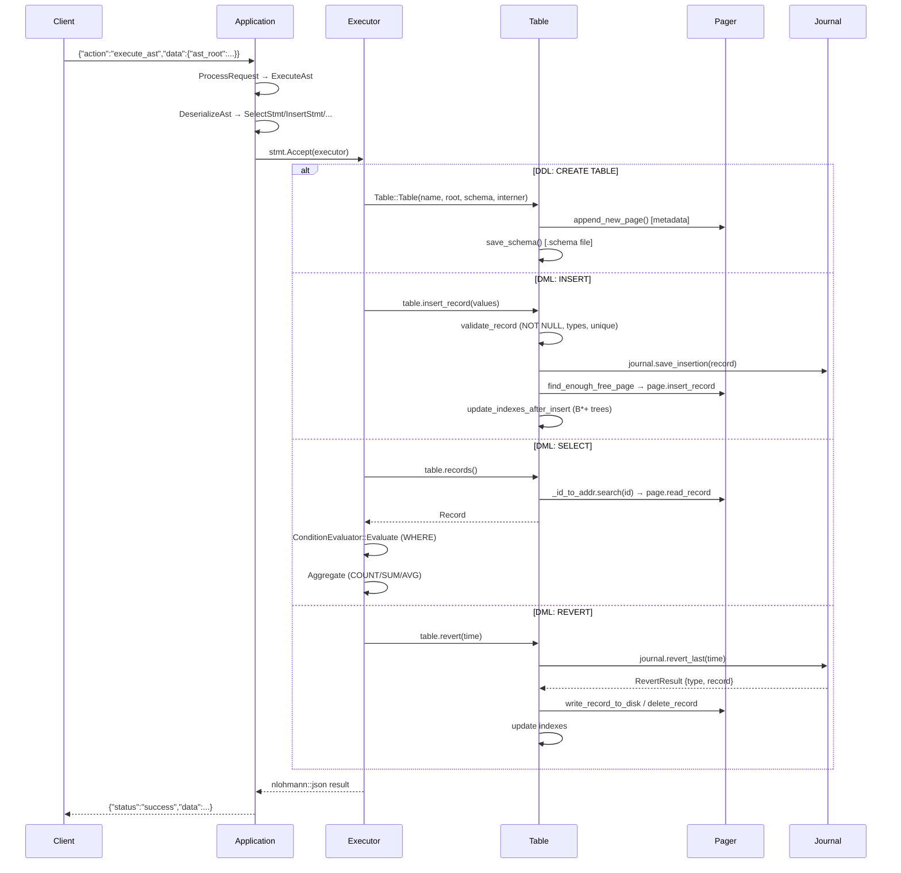

---

## 17. Резюме — все файлы и их назначение

| Файл | Назначение |
|------|------------|
| `application.h/cpp` | TCP-сервер, приём JSON, вызов Executor |
| `config.h/cpp` | Парсинг аргументов: host, port, data-dir |
| `db_manager.h/cpp` | Create/Drop/Use Database |
| `database.h/cpp` | Загрузка/создание таблиц, Interner |
| `table.h/cpp` | CRUD, индексы, журнал, валидация (607 строк) |
| `schema.h/cpp` | Метаданные колонок, null bitmap layout, QDB2 формат |
| `column.h/cpp` | Колонка: тип, флаги, default-значения |
| `record.h/cpp` | Запись: null bitmap сериализация, RecordAddress |
| `page.h/cpp` | Slotted page: вставка/чтение/удаление/compact |
| `pager.h/cpp` | Файловый I/O: read/write/append/truncate страниц |
| `b_star_plus_tree.h` | B*+ дерево (шаблон, 995 строк) |
| `node.h` | Узел B*+ дерева (662 строки) |
| `value.h/cpp` | Значение: NULL/INT/STRING, 3-значная SQL логика |
| `interner.h/cpp` | Интернирование строк (string_view pool) |
| `string_storage.h` | Большие строки в .bin файле (header-only) |
| `serializer.h/cpp` | Value → binary / binary → Value |
| `journal.h/cpp` | WAL с временным revert и branch-отсечением |
| `condition_evaluator.h/cpp` | WHERE: сравнения, BETWEEN, LIKE, AND/OR |
| `executor.h/cpp` | AST → операции с Database/Table |

---

## 18. B*+ Tree — детальные числовые характеристики

| Параметр | Значение |
|----------|----------|
| Размер страницы (PAGE_SIZE) | 4096 байт |
| Размер заголовка узла | 26 байт |
| **INTERNAL** (ключ int + page_id int): | |
| Макс. ключей | 505 |
| Мин. ключей (B* 2/3) | 337 |
| **LEAF** (ключ int + RecordAddress): | |
| Макс. пар | 337 |
| Мин. пар (B* 2/3) | 225 |
| **LEAF** (ключ FastStr 12Б + RecordAddress): | |
| Макс. пар | ≈204 |
| Мин. пар | ≈136 |
| **Количество уровней** при 1M записей | 3 (337^3 ≈ 38M) |
| **Количество уровней** при 1B записей | 4 |

---

## 19. Условные обозначения в коде

| Константа | Значение | Где |
|-----------|----------|-----|
| `PAGE_SIZE` | 4096 | pager, page, node, table |
| `MAX_SMALL_STR_LENGTH` | 2048 | table, serializer |
| `METADATA_PAGE_ID` | 0 | table, b_star_plus_tree |
| `DATA_PAGE_WITH` | 1 | table (первая data-страница) |
| `MAX_RECORD_SIZE` | 4072 | page (4096 - 16 - 8) |
| `FORMAT_MAGIC` | 0x51444232 | schema ("QDB2") |
| `FORMAT_VERSION` | 2 | schema |
| `JOURNAL_EXT` | `.jnl` | journal |
| `INDEX_EXT` | `.idx` | table |
| `DATA_EXT` | `.data` | table |
| `SCHEMA_EXT` | `.schema` | table |
| `STR_STORAGE_EXT` | `.bin` | table |

---

*Конец документа. Сгенерировано на основе исходного кода `apps/storage/` (ветка `stage/zero`).*
