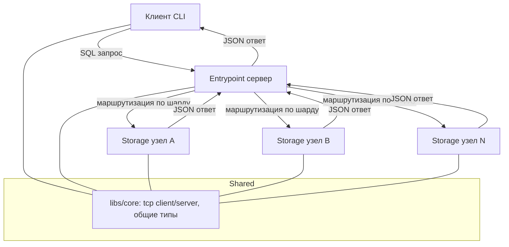
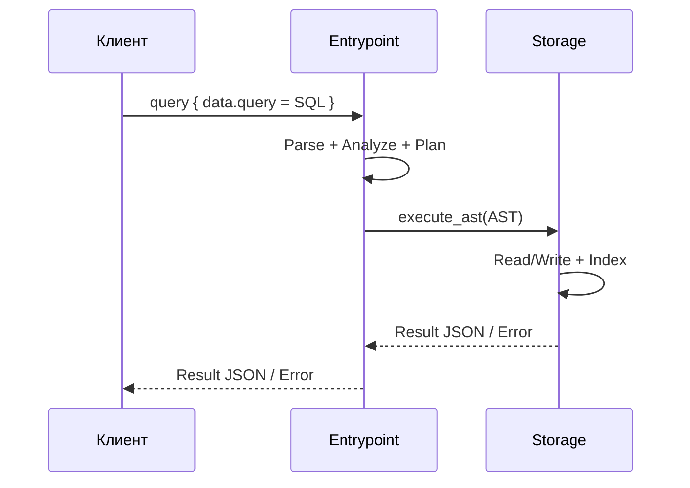
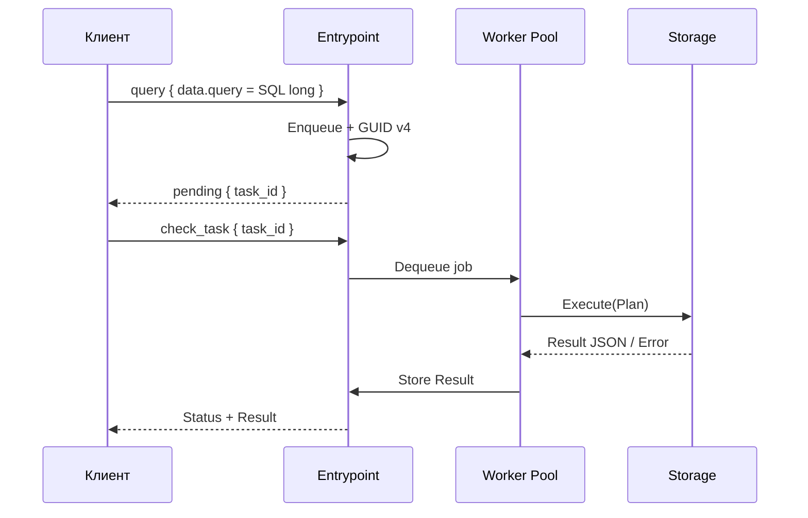
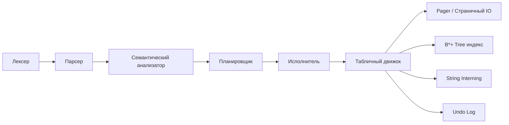

# Архитектура QuasarDB

## Обзор
QuasarDB — клиент-серверная СУБД на C++20 с кластерной серверной частью. Клиентский терминал отправляет SQL-подобные запросы на сервер Entrypoint, который маршрутизирует их на узлы Storage. Storage хранит данные на диске, использует индекс B*+-дерева, и возвращает результат в JSON.

Документ описывает целевую архитектуру и текущий базовый уровень в репозитории.

## Технологический стек
- Язык: C++20
- Сборка: CMake 3.16+, Ninja
- Зависимости: Conan, nlohmann/json, taywee/args, GTest
- Инструменты: clang-format, clang-tidy
- Среда: VS Code Dev Container (Ubuntu 22.04)

## Структура репозитория
- apps/client: CLI клиент
- apps/server: Entrypoint сервер (маршрутизация, безопасность, наблюдаемость)
- apps/storage: Storage узел (данные, индексы, журнал)
- libs/core: общий код и сетевые примитивы
- external: Conan манифесты
- build: артефакты сборки (не под контролем Git)

## Диаграмма компонентов

## Жизненный цикл запроса (синхронный)

## Жизненный цикл запроса (асинхронный)

## Внутренности Storage-движка

## Подсистемы сервера Entrypoint
- Сетевой слой: принятие TCP соединений и обмен JSON сообщениями.
- Маршрутизатор: распределение запросов по Storage узлам (шардирование).
- Очередь задач: обработка долгих запросов асинхронно.
- Наблюдаемость: логирование, телеметрия, мониторинг.
- Безопасность: аутентификация и RBAC.

## Подсистемы клиента
- Reader: ввод команд в интерактивном режиме и из файла.
- Renderer: отображение результатов и ошибок.
- Session: хранение состояния (текущая БД, токен, параметры подключения).
- Connection: обмен сообщениями с сервером.

## Подсистемы Storage
- Connection: входящие запросы от Entrypoint.
- Executor: выполнение планов над таблицами и индексами.
- Evaluator: вычисление условий WHERE.
- Aggregator: вычисление SUM/COUNT/AVG.
- Database/Table: управление метаданными и файлами.
- Pager: страничный IO.
- Index: B*+ дерево.
- Interner: дедупликация строк.
- Journal: журнал undo.

## Схема модулей и зависимостей

```mermaid
graph TD
    ClientApp[apps/client] --> CoreLib[libs/core]
    ServerApp[apps/server] --> CoreLib
    StorageApp[apps/storage] --> CoreLib

    ServerApp --> Lexer[server/lexer]
    ServerApp --> Parser[server/parser]
    ServerApp --> Analyzer[server/analyzer]
    ServerApp --> Optimizer[server/optimizer]
    ServerApp --> Router[server/router]
    ServerApp --> Security[server/security]
    ServerApp --> Logger[server/logger]
    ServerApp --> Telemetry[server/telemetry]
    ServerApp --> Monitor[server/monitor]

    StorageApp --> Executor[storage/executor]
    StorageApp --> Evaluator[storage/evaluator]
    StorageApp --> Aggregator[storage/agregator]
    StorageApp --> Database[storage/database]
    StorageApp --> Table[storage/table]
    StorageApp --> Pager[storage/pager]
    StorageApp --> Index[storage/b_star_plus_tree]
    StorageApp --> Interner[storage/interner]
    StorageApp --> Journal[storage/journal]
```

## Формат API и сообщения
- Вход: JSON запрос с полями `action`, `token`, `data`.
- Выход: JSON ответ со статусом, сообщением об ошибке и данными.
- Для асинхронного режима: `task_id` (GUID v4) и действие проверки статуса.
- Ошибки: `status: "error"`, человекочитаемое `message` и JSON `data`.

## Контракты запросов (план)
- query: `{ "action": "query", "token": "...", "data": { "query": "..." } }`.
- check_task: `{ "action": "check_task", "token": "...", "data": { "task_id": "..." } }`.
- telemetry: `{ "action": "telemetry", "token": "...", "data": {} }`.
- Ответ: `{ "status": "success|error|pending", "message": "...", "data": { ... } }`.

## Формат результата SELECT
- Возвращается JSON-массив объектов.
- Типы `int` и `string` сериализуются напрямую.
- NULL передается как `null`.

## Коды ошибок (план)
- SYNTAX_ERROR: синтаксическая ошибка.
- SEMANTIC_ERROR: несоответствие схеме, типам, NOT_NULL.
- AUTH_REQUIRED / UNAUTHORIZED: проблемы токена.
- NOT_FOUND: база/таблица/запись не найдены.
- INTERNAL_ERROR: ошибка сервера.

## Модель данных и ограничения
- Типы: `int`, `string`.
- Модификаторы: `NOT_NULL`, `INDEXED`, `DEFAULT`.
- Индексы: на колонках `INDEXED`, без дублирования данных (только ключи и ссылки).
- Проверка: синтаксическая и семантическая валидация запросов.

## Схема таблицы
- Имя таблицы.
- Список колонок: имя, тип, флаги `NOT_NULL`, `INDEXED`, `DEFAULT`.
- Служебные поля: внутренний идентификатор записи.

## Формат записи (план)
- Заголовок записи: флаги null и длины строк.
- Данные: фиксированная часть (int) и переменная (string).
- Ссылки на строки в interner вместо копий.

## Дисковый формат (план)
- Корень: каталог системы.
- Каждая БД: отдельная папка.
- Метаданные: описание таблиц и схемы.
- Табличные файлы: постраничные бинарные файлы.
- Индексы: отдельные файлы B*+-деревьев.
- Undo log: журнал обратных операций с временными метками.
- Пул строк: единичное хранение строковых значений.

## Страничный IO
- Размер страницы: 4 КБ.
- Pager обеспечивает append, read, write, truncate.
- Все операции записи синхронно сбрасываются на диск.

## Управление схемой
- CREATE DATABASE / DROP DATABASE меняют структуру папок.
- CREATE TABLE сохраняет схему в метаданные.
- DROP TABLE удаляет данные и индексы.

## Индексация и поиск
- Поиск по индексу: $O(\log N)$.
- Поддержка диапазонов, выборки по ключу и по условию.
- При наличии индекса запросы с WHERE используют индекс.

## Вставка и обновление
- INSERT проверяет типы и NOT_NULL.
- UPDATE применяет изменения и пишет undo записи.
- DELETE удаляет логически или физически с обновлением индексов.

## Журналирование и откат
- Перед изменениями пишется undo запись.
- Команда `REVERT` восстанавливает состояние на заданный момент.
- Полные снапшоты запрещены.

## Формат undo записи (план)
- Тип операции: create/delete/update/insert.
- Временная метка (ms).
- Идентификатор таблицы и записи.
- Данные для обратной операции.

## Аутентификация и RBAC
- Хранилище учетных записей, пароли хэшируются с солью.
- JWT токен выдается при логине.
- RBAC проверяет доступ к БД/таблицам на чтение/запись/создание/удаление.

## Роли и права (план)
- Пользователь может иметь собственные права и быть в группах.
- Права по умолчанию задаются на уровне БД.
- Проверка проходит на входе запроса и на уровне таблицы.

## Наблюдаемость
- Access log: запрос, ID клиента, ID обработчика, время начала/окончания, статус.
- Телеметрия: RPS, средний/макс RPS, среднее время обработки, Error Rate.
- Сбор метрик без тяжелых блокировок (atomics).

## Метрики (план)
- Текущий RPS рассчитывается по интервалам 1 сек.
- Средний/макс RPS — по окну 10 мин.
- Среднее время обработки — по окну 10 сек.
- Error Rate — по последней минуте.

## Конкурентность и потоки
- Entrypoint: прием соединений + пул воркеров.
- Healthcheck: отдельный поток пинга узлов.
- Async queue: потокобезопасная очередь задач.

## Параллельный доступ и синхронизация
- Для метаданных используются мьютексы/reader-writer lock.
- Для очередей и метрик — atomics и lock-free структуры (где возможно).
- Для индексов — блокировка на уровне таблицы или индекса.

## Конфигурация
- Конфигурация клиента: host, port, user, database.
- Конфигурация сервера: адреса узлов, таймауты, лимиты, режимы логирования.

## Порты и адреса (план)
- Entrypoint: основной порт для клиентов.
- Storage узлы: отдельные порты для взаимодействия с Entrypoint.
- Управляющие команды (healthcheck) проходят по тому же каналу.

## Тестирование
- Unit-тесты (GTest) на лексер, парсер, индекс, pager.
- Интеграционные тесты на маршрутизацию и хранение.
- Smoke тесты для проверки заголовков.

## CI/CD и качество
- Проверка форматирования clang-format.
- Статический анализ clang-tidy.
- Полный запуск тестов GTest.

## Текущее состояние (реализовано)
- Сборка с Conan + CMake для client/server/storage.
- Dev container, clang-format, clang-tidy конфигурации.
- Заглушки TCP client/server в core.
- Storage: pager и B*+-дерево с тестами.

## Пробелы (нужно реализовать)
- API контракт (API.md) и сетевой протокол.
- Парсер, анализатор, оптимизатор и исполнитель запросов.
- Иерархия БД/таблиц, интеграция индексов, пул строк, undo log, REVERT.
- Аутентификация/RBAC, логирование, телеметрия, async статус API.

## План минимального MVP
- Парсер базовых команд (CREATE/INSERT/SELECT).
- Storage: pager + таблицы + индекс по ключу.
- Entrypoint: маршрутизация на один Storage узел.
- Клиент: ввод, отправка, вывод результата.
